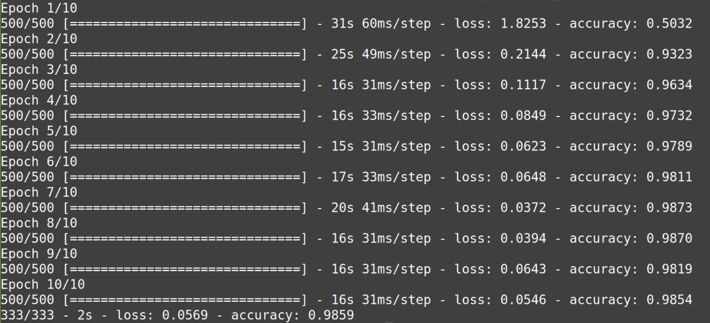
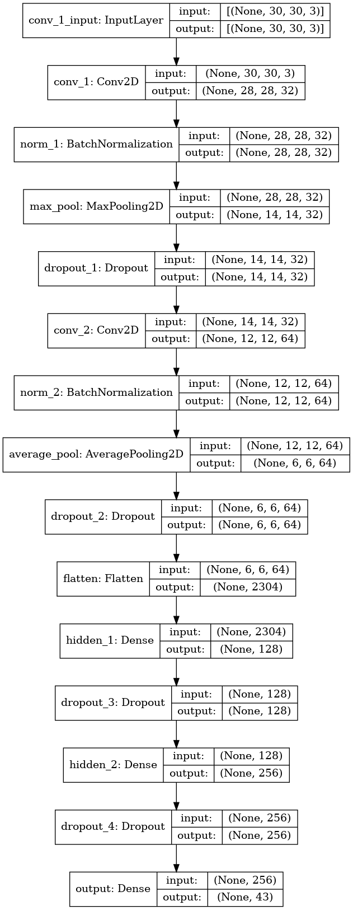

# CS50AI: Project 5 - Traffic

This is a description of what I did for the **Traffic** project.

My final output:

And final model:

## What did I try?

First, I tried to train my model using 1 _Convolutional layer_ and 1 _Hidden layer_ with _dropout_ and got about **92%** accuracy. Then, I tried to change the optimizer to _RMSprop_, _SGD_, and _Adam_. Afterward, I used 2 _Convolutional layers_ with _Normalization_ and _Pooling_, 2 _Hidden layers_, all with _dropout_ in between, and got better accuracy of **98%**.

## What worked well?

Using multiple layers with _adam_ optimizer worked very well.

## What didn’t work well?

Having a single _Convolutional layer_ with a _Hidden layer_ and no _dropout_ didn't work well and gave lower accuracy.

## What did you notice?

Having multiple layers with more units helps Improve accuracy. But there's a risk of overfitting the model. So, adding _dropout_ and controlling the learning rate is beneficial.
